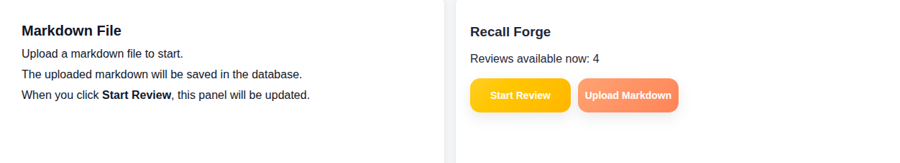
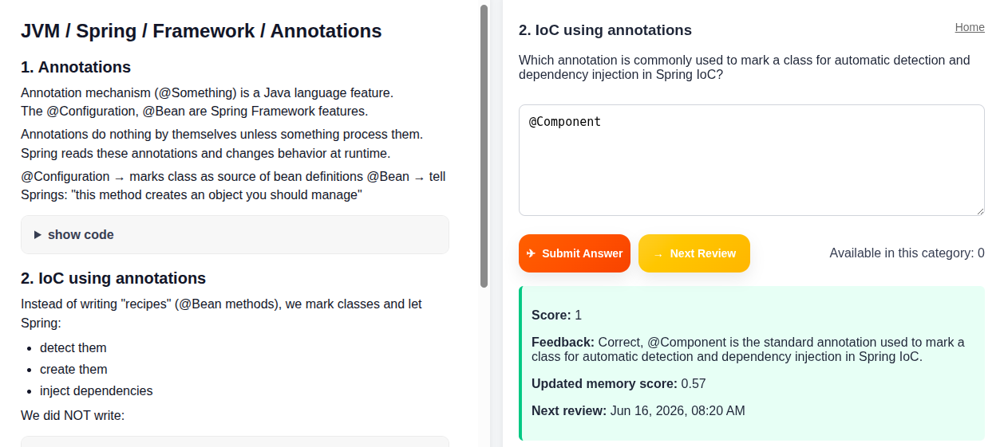

# Recall Forge - v1.0.1

The application import topics from a local README.md, ask review questions,  
evaluates answers with OpenAI, and stores memory in database.  

## 1. Backend-only
v1.0.1

- 1.1 Project structure
- 1.2 Gradle Settings 
- 1.3 Gradle Build
- 1.4 Docker Compose
- 1.5 OpenAPI 
- 1.6 Application Properties
- 1.7 Main App
- 1.8 Domain model (JPA)
- 1.9 Repositories
- 1.10 DTOs
- 1.11 OpenAI Config
- 1.12 Services
- 1.13 Controllers
- 1.14 Run the project
- 1.15 Api Requests

## 2. Repetition System
v1.0.2

- 2.1 Review History Endpoint
- 2.2 Due Topics Endpoint
- 2.3 Test it
- 2.4 Dashboard
- 2.5 Upload markdown file
- 2.6 Database clear
- 2.7 Due topics
- 2.8 Categories
- 2.9 Database backup
- 2.10 Queue Summary

## Screeshots

